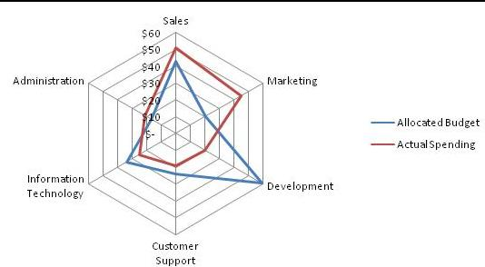

# Analysing Software Repositories to Understand Software Evolution

- Many tools have been developed for this
- Large companies have used these techniques to improve their software evolution process
- However, few tools are readily available off the shelf
- Goal is to make you aware of these approaches, so that you can consider using them in practice

## What is a software repository?

- Version control repositories
- Mailing list archives
- Bug tracking systems
- Issue tracking systems

## Interesting things we can find out

- Developer effort and social network analysis (how much are developers contributing to the project?)
- Change impact propagation (how much impact do change have?)
- Trend and hotspot analysis
- Fault and defect prediction

## General Approach

- Gather the data
- Use analysis tools to view the data

## Ex. Bug Tracking system

- Bugs are reported, and have parents that they can link to
- Gives a better representation and story of the current bug

### How many developers are involved in a component?
- May have only one, or may have many
- How does # of developers map to number of bug reports?

We can track things such as:
- Additions and removals made by developers
- Commits and ownership of files.

### Which software artifacts usually change together?

- File coupling
  - Year 1: file 1&2 changed together 7/7 times... strong coupling
  - Year 2: 2/6 times, weak
  - Year 3: 0/4 times, none
  - Over entire project, 9/17 times = strong coupling.

## Application example

ArgoUML is a UML diagramming application and analysis tool.

### Kiviat Diagrams
Also known as a radar chart

Used to show multivariate data on a 2d graph. Each line is a different criteria and there is some relative measure on how different projects did on each measure
