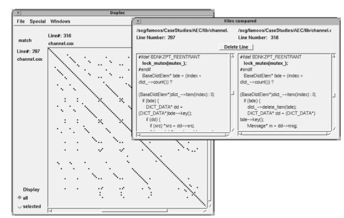
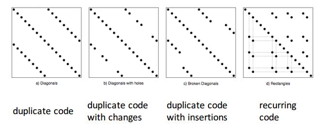
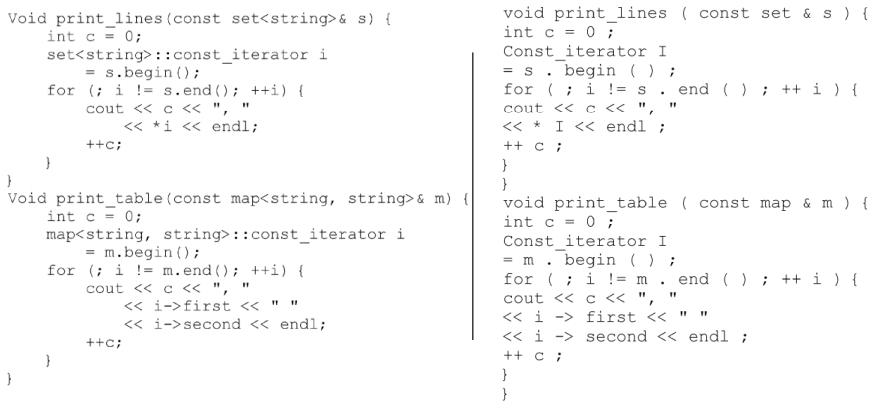
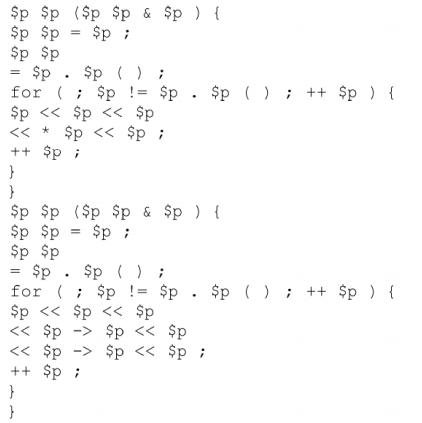
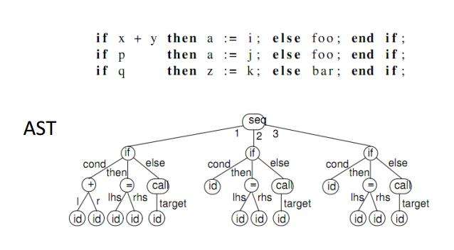
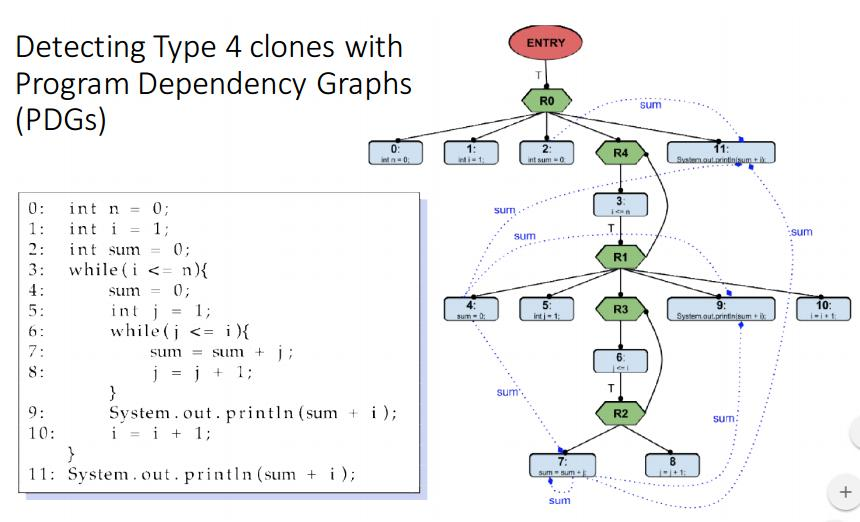
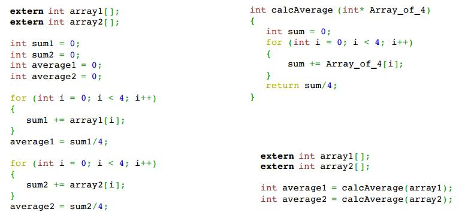

# Software Clones

7-23% (up to 59%) of code is duplicated

Clones are segments of code that are similar according to some definition of similarity

## Types of Clones

### __Type 1__

an exact copy without modification

- Text based
    - Noise elimination
        - Delete delimeters, comments, unnecessary whitespace else statements
    - Line by line removal

#### Type 1 programs

- Duploc
   
- Quality gate
- Atomiq

###__Type 2__

syntactically identical copy; only variable, type, or function identifiers have been changed

- Token Based
    - Look at what comes out of the lexical interpretation. The Tokens that are generated can be compared and you can find duplicates.
    1. generate tokens
      
    2. Then replace all tokens with a abstract parameter and look for similar structures
    
- Tree Based
    - Look at the abstract syntax tree and compare
    

### __Type 3__

a copy with further modifications

- Metric based
    - Use "fingerprints" to find similar bits of code in a sequence
    - I dont really understand this

### __Type 4__

code that implements the same concept

- Program Dependency Graph (PDG) based
    - 

## Reasons for Cloning

- Improves Readability
    - n version programming - multiple versions of the program are developed in isolation using the same specification. If multiple versions of the program output the same answer to a given input you can be confident it is correct
- Faster
    - Copy paste is simpler than generalizing
- Avoids breaking Existing
- Clarifies structure
- Not everything needs to be reused, some tedious tasks are easier to code for specifically
    - Code Scavenging

## Reasons Not To Clone

- More code
- Interrelated
    - Bug duplication
- It is a sign that you have poor architecture and a lack of communication in the dev team

## What to do about Clones

- Preventive - Dont allow Clones
- Compensative - Limit the negative impact
- Corrective - Actively remove clones

## Clone Removal

- Cloning can be a good strategy if you have the right tools in place, Let programmers copy and adjust, then let tools factor out the differences. - Ira Baxter
- There are tools that do this for you but be careful
    - Avoid false positives
    - Avoid false negatives
    - Scalability
        - Make sure the tool can handle a code base as it grows

### Functional Abstractions
- Break the functionality into a function call
  

## Clone Detections
