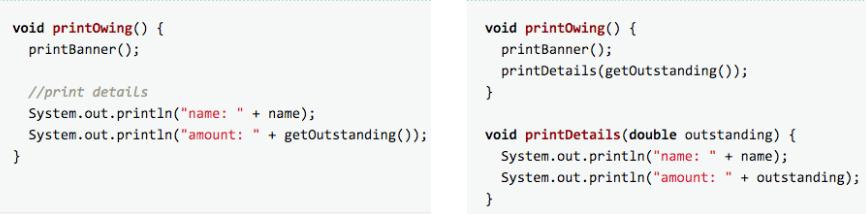
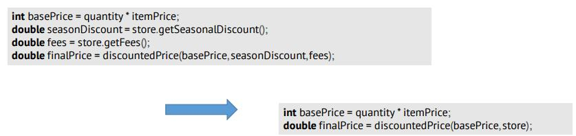
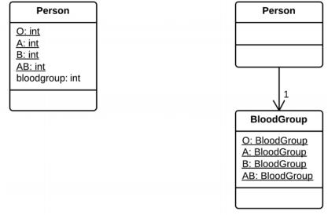
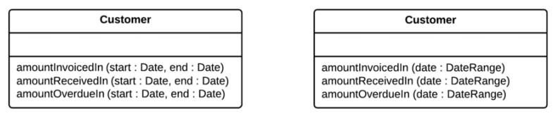
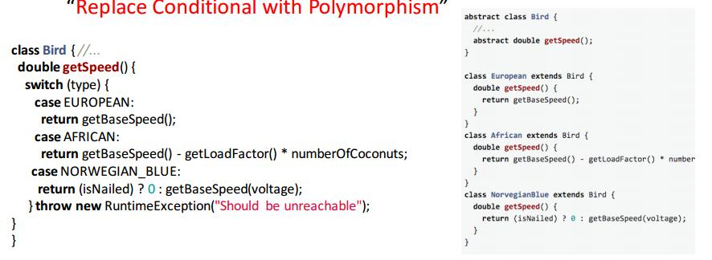

# Refactoring

Changing software in such a way that does not affect functionality of the program, but improves structure and maintainability of the software.

## Refactoring Today

- Pretty much all IDEs have refactoring tools built in
- Empirical studies show that practitioners still like to refactor manually (tools are hard to learn)
-  Current refactoring tools cannot absolutely guarantee semantic preservation. Therefore, refactoring goes hand in hand with unit testing.

## Two phase development cycles

- Iterative development

```
Expansion -------> Refactor
    ^                 |
    |_________________|
```
In expansion phase, don't worry about prettiness, you will refactor in the refactor phase.

## Code Smells
[Source](https://sourcemaking.com/refactoring/smells)

- __Bloaters__ - Bloaters are code, methods and classes that have increased to such gargantuan proportions that they are hard to work with. Usually these smells do not crop up right away, rather they accumulate over time as the program evolves (and especially when nobody makes an effort to eradicate them).

- __Object-Orientation Abusers__ - All these smells are incomplete or incorrect application of object-oriented programming principles.

- __Change Preventers__ - These smells mean that if you need to change something in one place in your code, you have to make many changes in other places too. Program development becomes much more complicated and expensive as a result.

- __Dispensables__ - A dispensable is something pointless and unneeded whose absence would make the code cleaner, more efficient and easier to understand.

- __Couplers__ - All the smells in this group contribute to excessive coupling between classes or show what happens if coupling is replaced by excessive delegation.

## What to Refactor

- __Bloaters__
    - Long Methods
        - Extract methods of similar operations remove temp varibles is possible
        
    - Large Classes
        - Extract Classes
        - Extract Sub Classes
        - Extract Interfaces
        - Replace Parameter With Method Call
            - Put a object that is used to calculate external parameters into the function call
            
    - Primitive Obsession
        - Replace	Type Code	with	Class
            - replace primative values with Classes
            
    - Long Parameter List
        - Introduce Parameter Object
            - Make a new object that is used to pass in long parameter lists
            
        - Replace	DataValue	with Object
            - make a new object to encapsulate some of the functionality
    - Data Clumps (some data always used together)
- Object Oriented Abusers
    - Dont use switch statements in object oriented programming
    
